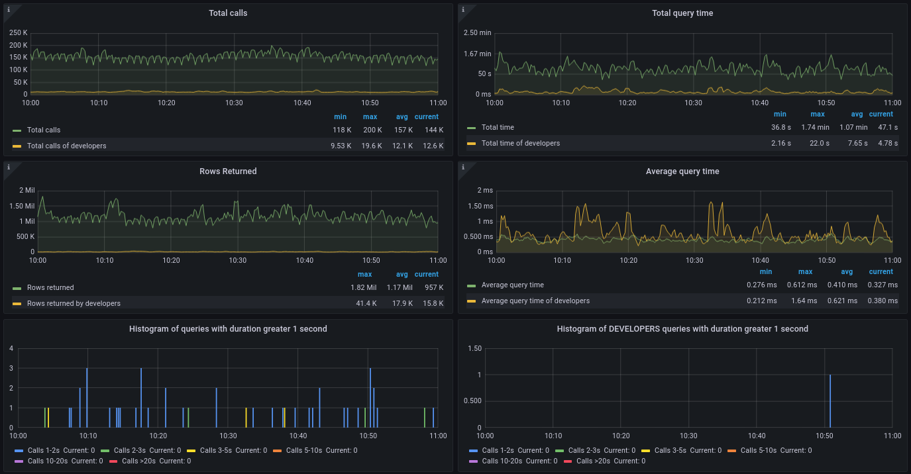
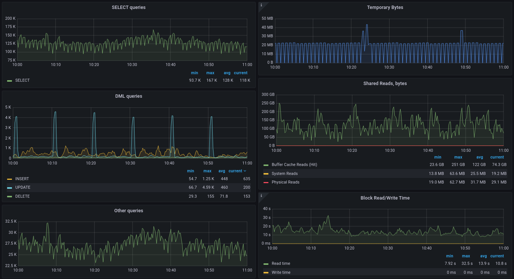
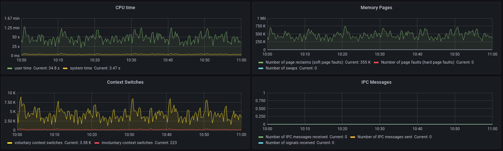
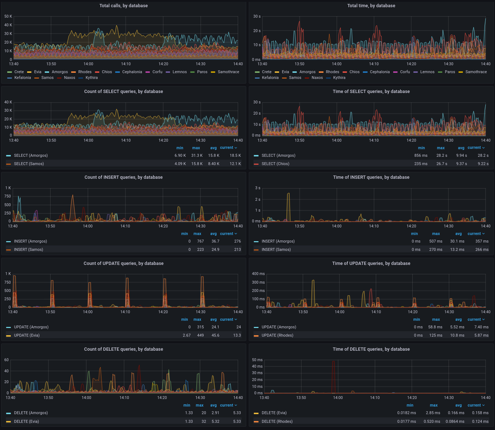

pg_stat_counters
================

The extension gathers the query execution statistics and groups it by user ID, database ID and 
the operation type (SELECT, INSERT, UPDATE,...). In addition, there are the general (aggregate)
statistics for the entire server as well as a simple histogram of the duration of the queries.
``pg_stat_counters`` is a PostgreSQL extension based on ``pg_stat_statements`` with large portions
of the code ported from ``pg_stat_kcache`` by powa-team. It can be used in monitoring systems like 
grafana, zabbix or any other.

Installation
------------

Compiling
~~~~~~~~~

The module can be built using the standard PGXS infrastructure. For this to work, the ``pg_config``
program must be available in your $PATH. Follow the installation instruction below:::

 git clone https://github.com/akonorev/pg_stat_counters.git
 cd pg_stat_counters
 make
 make install

PostgreSQL setup
~~~~~~~~~~~~~~~~

The extension is now available. However, as it requires some shared memory to hold its counters, 
the module must be loaded at PostgreSQL startup. Thus, you must add the module to 
``shared_preload_libraries`` in your ``postgresql.conf``. You need a server restart to take the
change into account.

Add the following parameters into your ``postgresql.conf``:::

 # postgresql.conf
 shared_preload_libraries = 'pg_stat_counters'

Once your PostgreSQL cluster is restarted, you can install the extension in each database 
where you need to access to the statistics:::

 mydb=# CREATE EXTENSION pg_stat_counters;

Configuration
-------------

The following GUCs can be configured in ``postgresql.conf``:

- *pg_stat_counters.max* (integer, default ``100``) 
  
  ``pg_stat_counters.max`` is the maximum number of the query execution stats (calls by database ID,
  user ID and operation type) tracked by the module (i.e., the maximum number of rows in the 
  ``pg_stat_counters`` view). If the number of observed the query execution stats exceeds the pre-set
  number then the information about the oldest execution stats is discarded. The number of times 
  such information was discarded can be seen in the ``pg_stat_counters_info`` view. This parameter
  can only be set at the server start.

- *pg_stat_counters.track* (enum, default ``top``)
 
  ``pg_stat_counters.track`` controls which statements are tracked by the module. Specify ``top``
  to track top-level statements (those issued directly by clients), ``all`` to also track nested 
  statements (such as statements invoked within functions), or ``none`` to disable statement
  statistics collection. Only superusers can change this setting.

- *pg_stat_counters.track_utility* (boolean, default ``on``)
  
  ``pg_stat_counters.track_utility`` controls whether utility commands are tracked by the module. 
  Utility commands are all those other than SELECT, INSERT, UPDATE and DELETE. Only superusers 
  can change this setting.

- *pg_stat_counters.save* (boolean, default ``on``)

  ``pg_stat_counters.save`` specifies whether to save the query execution statistics across the
  server shutdowns. If the value is ``off`` then statistics are not saved at the shutdown nor
  reloaded at the server start. This parameter can only be set in the ``postgresql.conf`` 
  file or in the server command line.

- *pg_stat_counters.linux_hz* (integer, default ``-1``)
  
  ``pg_stat_counters.linux_hz`` inform ``pg_stat_counters`` of the linux CONFIG_HZ config option.
  This is used by ``pg_stat_counters`` to compensate for sampling errors in getrusage due to the
  kernel adhering to its ticks. The default value, ``-1``, tries to guess it at startup.

Usage
-----

``pg_stat_counters`` creates several objects.

pg_stat_counters view
~~~~~~~~~~~~~~~~~~~~~

This view displays the query execution statistics grouped by database ID, user ID and the operation. The view
contains up to ``pg_stat_counters.max`` number of rows. The oldest records will be deallocated and the
``dealloc`` field in the ``pg_stat_counters_info`` will be respectively increased if observes more calls.

+---------------------+------------------+----------------------------------------------------------------------+
| Name                | Type             | Description                                                          |
+=====================+==================+======================================================================+
| userid              | oid              | User OID                                                             |
+---------------------+------------------+----------------------------------------------------------------------+
| dbid                | oid              | Database OID                                                         |
+---------------------+------------------+----------------------------------------------------------------------+
| operation           | oid              | Operation OID                                                        |
+---------------------+------------------+----------------------------------------------------------------------+
| calls               | bigint           | Number of times the statement was executed                           |
+---------------------+------------------+----------------------------------------------------------------------+
| calls_1_2s          | bigint           | Number of times the statement was executed with duration             |
|                     |                  | greater than or equal 1 seconds and less than 2 seconds              |
+---------------------+------------------+----------------------------------------------------------------------+
| calls_2_3s          | bigint           | Number of times the statement was executed with duration             |
|                     |                  | greater than or equal 2 seconds and less than 3 seconds              |
+---------------------+------------------+----------------------------------------------------------------------+
| calls_3_5s          | bigint           | Number of times the statement was executed with duration             |
|                     |                  | greater than or equal 3 seconds and less than 5 seconds              |
+---------------------+------------------+----------------------------------------------------------------------+
| calls_5_10s         | bigint           | Number of times the statement was executed with duration             |
|                     |                  | greater than or equal 5 seconds and less than 10 seconds             |
+---------------------+------------------+----------------------------------------------------------------------+
| calls_10_20s        | bigint           | Number of times the statement was executed with duration             |
|                     |                  | greater than or equal 10 seconds and less than 20 seconds            |
+---------------------+------------------+----------------------------------------------------------------------+
| calls_gt20s         | bigint           | Number of times the statement was executed with duration             |
|                     |                  | greater than or equal 20 seconds                                     |
+---------------------+------------------+----------------------------------------------------------------------+
| total_time          | double precision | Total time spent executing the statement, in milliseconds            |
+---------------------+------------------+----------------------------------------------------------------------+
| rows                | bigint           | Total number of rows retrieved or affected by the statement          | 
+---------------------+------------------+----------------------------------------------------------------------+
| shared_blks_hit     | bigint           | Total number of shared block cache hits by the statement             |
+---------------------+------------------+----------------------------------------------------------------------+
| shared_blks_read    | bigint           | Total number of shared blocks read by the statement                  |
+---------------------+------------------+----------------------------------------------------------------------+
| shared_blks_dirtied | bigint           | Total number of shared blocks dirtied by the statement               |
+---------------------+------------------+----------------------------------------------------------------------+
| shared_blks_written | bigint           | Total number of shared blocks written by the statement               |
+---------------------+------------------+----------------------------------------------------------------------+
| local_blks_hit      | bigint           | Total number of local block cache hits by the statement              |
+---------------------+------------------+----------------------------------------------------------------------+
| local_blks_read     | bigint           | Total number of local blocks read by the statement                   |
+---------------------+------------------+----------------------------------------------------------------------+
| local_blks_dirtied  | bigint           | Total number of local blocks dirtied by the statement                |
+---------------------+------------------+----------------------------------------------------------------------+
| local_blks_written  | bigint           | Total number of local blocks written by the statement                |
+---------------------+------------------+----------------------------------------------------------------------+
| temp_blks_read      | bigint           | Total number of temp blocks read by the statement                    |
+---------------------+------------------+----------------------------------------------------------------------+
| temp_blks_written   | bigint           | Total number of temp blocks written by the statement                 |
+---------------------+------------------+----------------------------------------------------------------------+
| blk_read_time       | double precision | Total time the statement spent reading blocks, in milliseconds       |
|                     |                  | (if ``track_io_timing`` is enabled, otherwise zero)                  |
+---------------------+------------------+----------------------------------------------------------------------+
| blk_write_time      | double precision | Total time the statement spent writing blocks, in milliseconds       |
|                     |                  | (if ``track_io_timing`` is enabled, otherwise zero)                  |
+---------------------+------------------+----------------------------------------------------------------------+
| wal_records         | bigint           | Total number of WAL records generated by statements                  |
+---------------------+------------------+----------------------------------------------------------------------+
| wal_fpi             | bigint           | Total number of WAL full page images generated by statements         |
+---------------------+------------------+----------------------------------------------------------------------+
| wal_bytes           | numeric          | Total amount of WAL generated by statements in bytes                 |
+---------------------+------------------+----------------------------------------------------------------------+
| cpu_user_time       | double precision | User CPU time used executing statements, in milliseconds             |
+---------------------+------------------+----------------------------------------------------------------------+
| cpu_sys_time        | double precision | System CPU time used executing statements, in milliseconds           |
+---------------------+------------------+----------------------------------------------------------------------+
| minflts             | bigint           | Number of page reclaims (soft page faults) executing statements      |
+---------------------+------------------+----------------------------------------------------------------------+
| majflts             | bigint           | Number of page faults (hard page faults) executing statements        |
+---------------------+------------------+----------------------------------------------------------------------+
| nswaps              | bigint           | Number of swaps executing statements                                 |
+---------------------+------------------+----------------------------------------------------------------------+
| reads               | bigint           | Number of bytes read by the filesystem layer executing statements    |
+---------------------+------------------+----------------------------------------------------------------------+
| writes              | bigint           | Number of bytes written by the filesystem layer executing statements |
+---------------------+------------------+----------------------------------------------------------------------+
| msgsnds             | bigint           | Number of IPC messages sent executing statements                     |
+---------------------+------------------+----------------------------------------------------------------------+
| msgrcvs             | bigint           | Number of IPC messages received executing statements                 |
+---------------------+------------------+----------------------------------------------------------------------+
| nsignals            | bigint           | Number of signals received executing statements                      |
+---------------------+------------------+----------------------------------------------------------------------+
| nvcsws              | bigint           | Number of voluntary context switches executing statements            |
+---------------------+------------------+----------------------------------------------------------------------+
| nivcsws             | bigint           | Number of involuntary context switches executing statements          |
+---------------------+------------------+----------------------------------------------------------------------+

Note: Statistics on WAL is available for version 13 and above

dba_stat_counters view
~~~~~~~~~~~~~~~~~~~~~~

This view displays the same info as ``pg_stat_counters`` but in a human-readable form.

pg_stat_counters_all view
~~~~~~~~~~~~~~~~~~~~~~~~~

This view contains summary of the query execution statistics. If happen deallocate in
``pg_stat_counters``, then the information in this view will not be affected. This view
contains only a single row and the same fields as in pg_stat_counters except the user ID, 
database ID and operation fields.

pg_stat_counters_info view
~~~~~~~~~~~~~~~~~~~~~~~~~~

The statistics of the ``pg_stat_counters`` module itself are tracked and can be viewed 
in ``pg_stat_counters_info``. This view contains only a single row.

+----------------+----------------+------------------------------------------------------------------------------+
| Name           | Type           | Description                                                                  |
+================+================+==============================================================================+
| dealloc        | bigint         | Total number of deallocations of the ``pg_stat_counters`` entries containing |
|                |                | info about the oldest calls. Deallocations happen if the number of observed  |
|                |                | calls entries exceeds ``pg_stat_counters.max`` value                         |
+----------------+----------------+------------------------------------------------------------------------------+
| stats_reset    | timestamp with | Time of the last reset of all statistics                                     |
|                | time zone      |                                                                              |
+----------------+----------------+------------------------------------------------------------------------------+

pg_stat_counters_reset() function
~~~~~~~~~~~~~~~~~~~~~~~~~~~~~~~~~

This function resets the statistics gathered by ``pg_stat_counters``. Can be called by superusers::

 SELECT pg_stat_counters_reset();

 
Examples
--------
::

 postgres=# select datname, usename, operation, calls, calls_1_2s, calls_2_3s, calls_3_5s, calls_5_10s, calls_10_20s, calls_gt20s, total_time
 postgres-# from dba_stat_counters;
  datname  | usename  | operation | calls | calls_1_2s | calls_2_3s | calls_3_5s | calls_5_10s | calls_10_20s | calls_gt20s |    total_time    
 ----------+----------+-----------+-------+------------+------------+------------+-------------+--------------+-------------+------------------
  postgres | postgres | SELECT    |     5 |          0 |          0 |          0 |           0 |            0 |           0 |        48.962593
  pgb1     | postgres | UTILITY   | 34308 |          0 |          0 |          0 |           0 |            0 |           0 | 114.228314999999
  pgb1     | postgres | UPDATE    | 51462 |       2515 |        850 |        482 |         208 |           41 |           2 | 15927293.5513021
  pgb1     | postgres | SELECT    | 17157 |          0 |          0 |          0 |           0 |            0 |           0 |      1554.865629
  pgb1     | postgres | INSERT    | 17154 |         13 |          0 |          0 |           0 |            0 |           0 |     41394.959959
 (5 rows)

Dashboard examples
------------------

General database statistics.

Detailed statistics.

Compatibility
-------------

``pg_stat_counters`` is compatible with the PostgreSQL from 9.4 to 18 releases.

Authors
-------

Alexey Konorev <alexey.konorev@gmail.com>

License
-------

``pg_stat_counters`` is free software distributed under the PostgreSQL license.

Copyright (c) 2021, Alexey E. Konorev

